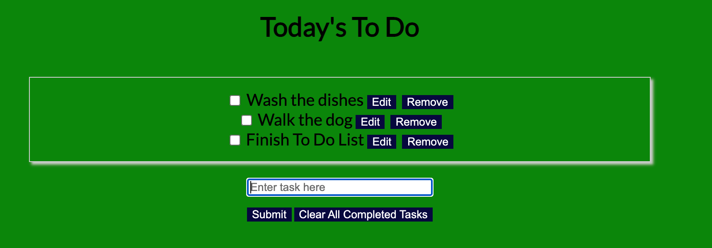

# To Do List

> This is a project created during my Microverse career where I needed to build a website that creates a To Do List of things you want to accomplish daily

## Built With

- HTML, CSS and Javascript

## Authors

👤 **Santiago Velosa**

- GitHub: [@vechicin](https://github.com/vechicin)
- Twitter: [@therealvelosa](https://twitter.com/therealvelosa)
- LinkedIn: [Santiago Velosa Arias](https://www.linkedin.com/in/santiago-velosa-arias-5b7543112/)

## Getting Started

To get a local copy up and running follow these simple example steps.

1- Navigate to the button on the top right green "code" button.

2- In the drop down menu choose "Download Zip" or clone it using git using the following command.
~~~bash
$ git clone git@github.com:vechicin/To-Do-List.git
~~~
3- After extracting the files, you'll have my project on your local machine.

4- to run the project you'll need to use the following command in your terminal to set up the node modules.
~~~bash
$ npm i
~~~

## 🔎 Live Demo Link
If you want to take a look at the project's online version, [click here](https://vechicin.github.io/To-Do-List/)

## 🤝 Contributing

Contributions, issues, and feature requests are welcome!

Feel free to check the [issues page](https://github.com/vechicin/Hello-Microverse/issues).

## Show your support

Give a ⭐️ if you like this project!

## Acknowledgments

  - Kero for always being willing to collaborate
  - Elias Castañeda for being of tremendous help

## 📝 License

This project is [MIT](./MIT.md) licensed.
